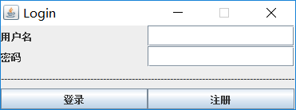

# 学生信息管理系统  
Java实现单机版学生信息管理系统，主要涉及Java图形界面开发和数据库操作。

## 开发环境
- 开发语言：Java 1.8
- 数据库：Mysql
- 开发工具：Eclipse

## 实现功能
1. 使用GUI图形用户界面；   
2. 设置学生与老师两种角色，能够实现其注册登陆功能  
3. 用数据库(任意数据库)建立2~3个表，列属性任意  
4. 可实现各表的增删改查，提供搜索框（按姓名关键字查询）  
5. 学生账户只能查看和索引，老师账户拥有所有权限

## 效果图

## 数据库设计
- student表：

- admin表：

## Authors
qiwenkaikai@qq.com